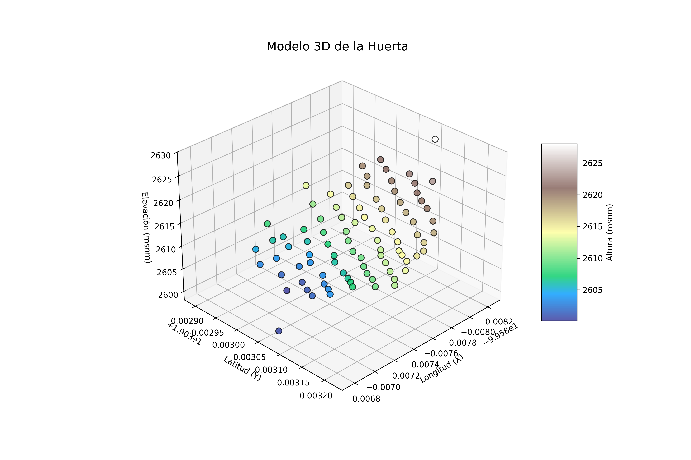
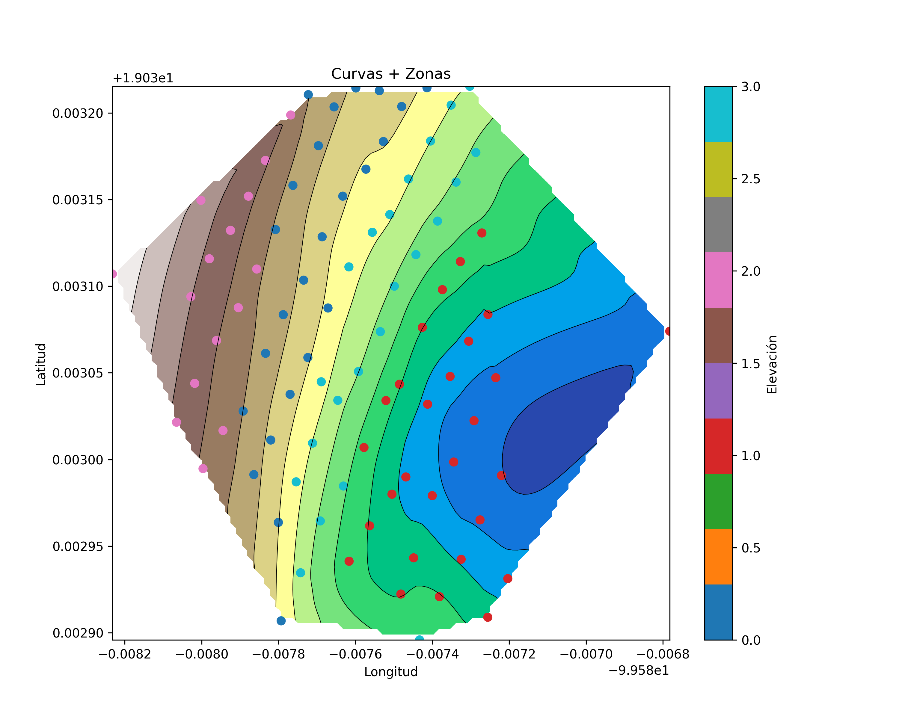

# Modelado Geoespacial y Segmentación de Sectores de Riego con Python

### Descripción

Este proyecto tiene como objetivo analizar la distribución espacial y topográfica de un predio agrícola a partir de datos geoespaciales, con el fin de identificar zonas homogéneas que sirvan como base para la planificación de riego.

A partir de archivos KML generados en campo, se procesan coordenadas y elevaciones para construir modelos del terreno, analizar pendientes y segmentar el área en sectores con características similares.

### Visualizaciones
### Modelo 3D del Terreno

### Curvas de Nivel y Zonificación

Modelado Geoespacial y Segmentación de Sectores de Riego con Python

Procesamiento de datos KML y análisis topográfico para el modelado 3D del terreno, generación de curvas de nivel y segmentación de sectores de riego mediante técnicas de clustering.

### Instalación

pip install pandas matplotlib scipy scikit-learn folium python-docx playwright
playwright install

### Ejecución

python main.py

### Input
Archivos .kml generados desde Google Earth
Contienen:
Coordenadas (latitud, longitud)
Elevación de puntos del terreno
### Output
Modelo 3D del terreno
Curvas de nivel
Segmentación de sectores de riego
Mapa geoespacial con visualización satelital
Captura automática del mapa
Reporte en Word con resultados
### Metodología
1. Procesamiento de datos
Extracción de coordenadas y elevaciones desde archivos KML y estructuración en DataFrame.
2. Modelado 3D
Visualización tridimensional para analizar la topografía del terreno.
3. Curvas de nivel
Interpolación espacial para representar la distribución de elevaciones.
4. Segmentación de zonas
Aplicación de K-Means para agrupar áreas con características similares.
5. Flujo superficial
Aproximación del comportamiento del agua basada en diferencias de elevación.
6. Visualización geoespacial
Generación de mapas interactivos utilizando Folium con imágenes satelitales.
7. Generación de reportes
Creación automática de documentos Word con imágenes y descripciones del análisis.
### Resultados
Levantamiento del terreno
Modelado 3D
Curvas de nivel
Segmentación de zonas

### Estructura del proyecto
proyecto/
│
├── data/
│   └── input/
│   └── output/
│
├── results/
│   ├── images/
│   └── report/
│
├── docs/
├── src/
├── main.py
├── requirements.txt
└── README.md
### Notas
Este proyecto no diseña un sistema de riego completo
El análisis presentado es una aproximación basada en elevación
Sirve como base para la toma de decisiones en campo
Posibles mejoras
Cálculo de pendientes más precisos
Integración con herramientas GIS
Diseño hidráulico del sistema de riego
Optimización automática del número de clusters
### Autor

José Aron Salgado Ramirez
